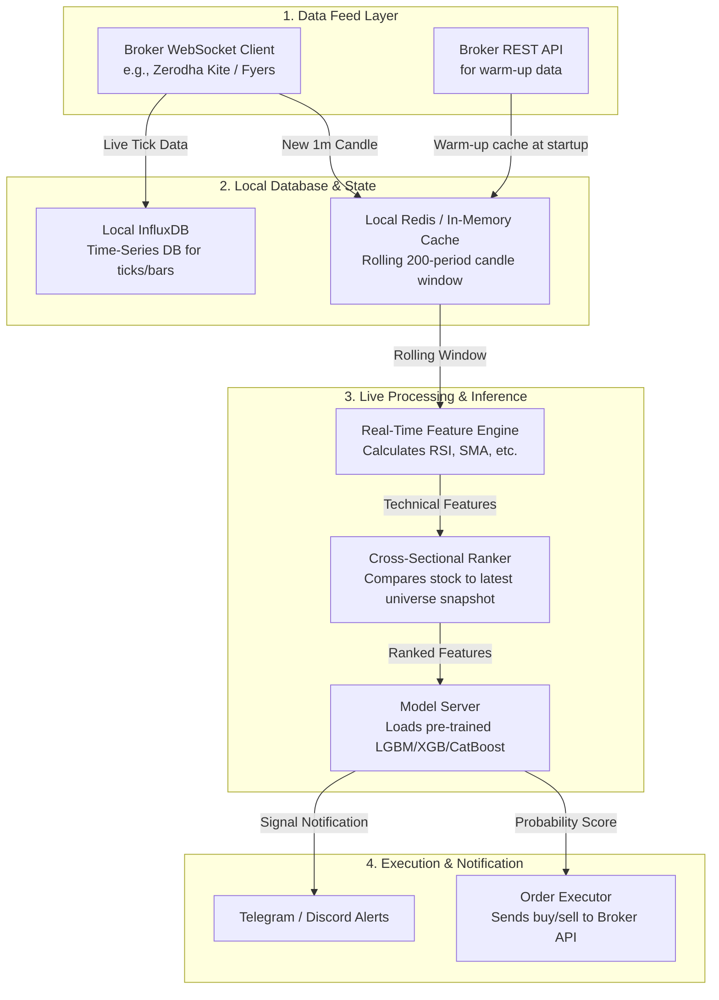

# StockMaster v2: Real-Time Live Trading System Architecture

This document outlines the proposed architecture for **StockMaster v2**, transitioning from a batch End-of-Day (EOD) system to a real-time, event-driven trading system.

To keep hosting costs at **zero**, the entire stack is designed to run locally on your machine using Docker/Homebrew and open-source tools.

---

## 1. System Architecture Diagram

---

## 2. Component Specifications

### 2.1. Local Databases (No-Cost Stack)
* **InfluxDB (Local Docker or Homebrew):**
  * **Role:** A dedicated time-series database. It is extremely fast for writing tick data and raw candles.
  * **Why:** Running InfluxDB locally is completely free. It prevents memory bloat by storing historical ticks on disk while offering sub-millisecond retrieval.
* **Redis (Local Homebrew):**
  * **Role:** Fast in-memory state manager.
  * **Why:** Redis is also 100% free to run locally. We use it to store a rolling list of the last 200 candles for each stock (e.g., as a Redis List). When a new 1-minute candle arrives, we push it to Redis and trim the list to maintain exactly 200 items, allowing instant computation of moving averages.

### 2.2. The Warm-Up Pipeline (Startup Phase)
When you start the script at 9:15 AM:
1. It requests the last 200 days/minutes of historical data for all 500 stocks from the broker's REST API.
2. It populates the Redis cache.
3. This ensures that the very first live candle that arrives at 9:16 AM has all the historical data needed to calculate `SMA_200` and `RSI_14` immediately.

### 2.3. The Real-Time Feature & Cross-Sectional Ranking Engine
* When a new 1-minute candle is completed:
  1. The **Feature Engine** calculates indicators (RSI, SMA distances) for that stock.
  2. The **Cross-Sectional Ranker** keeps a shared in-memory dictionary of the latest indicators for all 500 stocks. It updates the entry for the active stock and computes its percentile ranks against the other 499 stocks.
  3. The normalized features are fed into the machine learning models.

### 2.4. Model Server (Offline Training, Online Inference)
* **Offline (`train.py`):** Runs once a week/month. It downloads historical data, trains the LightGBM/XGBoost/CatBoost models, and saves them to disk as lightweight binary files (`model.joblib`).
* **Online (`inference.py`):** Runs during market hours. It loads the saved models at startup and simply calls `.predict_proba()` on the real-time features. This execution takes less than 1 millisecond.

---

## 3. Recommended Phased Implementation Plan

To avoid overwhelming complexity, we should build Version 2 in three steps:

### Phase 1: Split Train & Inference (Easy)
1. Modify your current codebase to separate **training** from **ranking/inference**.
2. Create `train.py` which saves the trained ensemble model to a `.joblib` file.
3. Create `screen.py` which loads the saved model, pulls the latest data, and outputs the ranking (without retraining).

### Phase 2: Local Docker Setup & Local InfluxDB/Redis (Medium)
1. Set up a local `docker-compose.yml` containing InfluxDB and Redis.
2. Write a Python script to populate the local InfluxDB with your existing historical parquet data.
3. Create a utility module to fetch rolling 200-period windows from Redis.

### Phase 3: Live WebSocket Feeder & Mock Execution (Hard)
1. Write the WebSocket connection script to ingest live data (or simulate live data using historical data).
2. Wire the inputs into the feature engine and make predictions in real-time.
3. Hook up a mock execution module that simulates buying/selling on a paper trading account.
